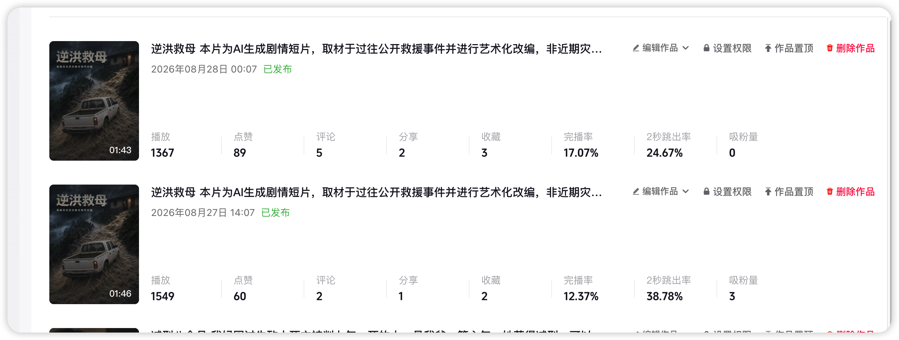
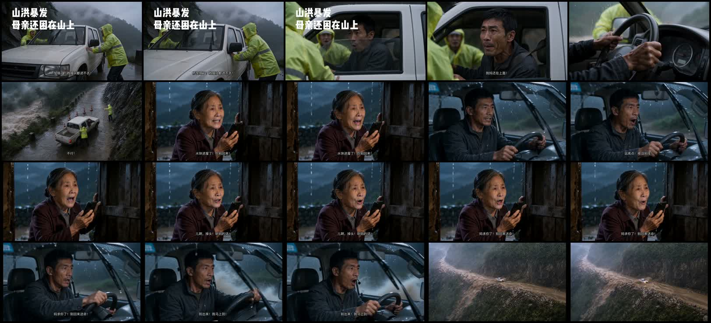
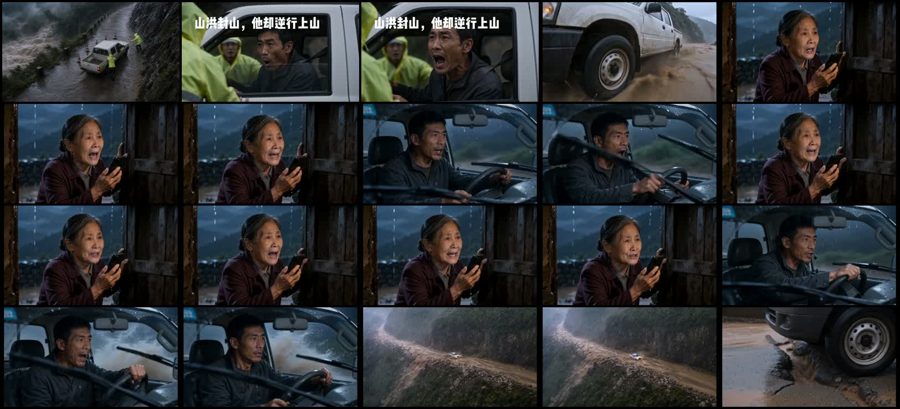

# 自有A/B复盘：《逆洪救母》开场重剪

数据采集日期：2026-08-28（Asia/Shanghai；用户提供创作者中心同屏截图，精确截图时刻未记录）

## 一、为什么保存这组案例

这是同一账号、同一故事、相同封面与近似发布文案的两次发布。B版主要重剪开场并缩短约3秒；平台同屏快照显示，B版2秒跳出率、完播率和点赞率均优于A版。它不是随机分流实验，不能证明某一个剪辑动作单独造成改善，但比跨账号、跨题材的公开爆款更接近可迁移的自有迭代证据。

## 二、版本身份与页面事实

| 指标 | A版：原剪辑 | B版：开场重剪 | B-A变化 |
|---|---:|---:|---:|
| 页面发布时间 | 2026-08-27 14:07 | 2026-08-28 00:07 | 相差约10小时 |
| 页面时长 | 1:46 | 1:43 | -3秒 |
| 播放 | 1549 | 1367 | -182 |
| 点赞 | 60 | 89 | +29 |
| 评论 | 2 | 5 | +3 |
| 分享 | 1 | 2 | +1 |
| 收藏 | 2 | 3 | +1 |
| 完播率 | 12.37% | 17.07% | +4.70个百分点；相对约+38.0% |
| 2秒跳出率 | 38.78% | 24.67% | -14.11个百分点；相对约下降36.4% |
| 吸粉量 | 3 | 0 | -3 |

按页面播放数近似计算：

| 互动率 | A版 | B版 | 变化 |
|---|---:|---:|---:|
| 点赞/播放 | 3.87% | 6.51% | +2.64个百分点；相对约+68.1% |
| 评论/播放 | 0.13% | 0.37% | 小样本，仅作描述 |
| 分享/播放 | 0.06% | 0.15% | 小样本，仅作描述 |
| 收藏/播放 | 0.13% | 0.22% | 小样本，仅作描述 |
| 吸粉/播放 | 0.19% | 0% | B版没有同步改善 |

本地候选成片与页面时长相符：

- A版：`/Volumes/Seamless SSD/dev/ai短视频/两个显眼包/短故事/回来-179秒真实事件改编/修正版/8月26日(2)-完整字幕修正版.mp4`，106.267秒，SHA-256 `a6cbe887a5cad8fcf416a0086c9070ab3e0cc45c0416fbdc688b94b500e83e11`。
- B版：`/Volumes/Seamless SSD/dev/ai短视频/两个显眼包/短故事/回来-179秒真实事件改编/修正版/8月26日(6)-完整字幕修正版.mp4`，102.888秒，SHA-256 `e4f3304ccf82cc26b5bfa3d13f3680b275aba3bc136209a626e00d42517fcf0d`。

平台没有提供上传文件哈希，因此这里只记录“本地文件时长与发布卡片相符”，不把字节级同一性写成平台事实。

## 三、开场具体改了什么

### A版：先解释被困，再等待车辆行动

- 第一帧主要是路障前的静止车辆与救援员；顶部文字为“山洪暴发／母亲还困在山上”。
- 约2—4秒才完整出现儿子喊“我妈还在上面”。
- 约5秒出现车辆突破的俯视动作，随后进入较长电话段。
- 文字已经交代母亲被困，但画面没有在第一帧立刻兑现逆行动作，电话又重复“被困／别回来”的同一危险。

### B版：第一帧给行动异常，三秒内完成关系与选择

- 第一帧改为俯视车辆已处于突破／移动关系中，救援员仍在车旁阻止。
- 顶部文字改为“山洪封山，他却逆行上山”，文字职责从解释背景改为命名反常行动。
- 约0.42秒出现“桥快塌了”，约1.47秒出现“我妈还在上面”，约3秒进入车轮冲水，约4.45秒进入母亲电话。
- 删除了原来的“不行！”短停顿；开场阻力、关系答案和行动选择更紧密。
- 后半段主要对白从约23.61秒起整体比上一版提前1.23秒；故事高潮和结尾结构基本保留。

## 四、这组数据支持什么

### 可复核事实

1. B版的2秒跳出率比A版低14.11个百分点。
2. B版的完播率比A版高4.70个百分点。
3. B版播放数略低，但点赞数更高，点赞率约从3.87%升至6.51%。
4. B版没有带来更高吸粉量；A版为3，B版为0。
5. 两版发布时间、作品年龄和平台流量分配不同；不是同一批观众的随机对照。

### 较稳妥的推断

- 改动最直接落在前两秒，而改善幅度最大的指标也是2秒跳出率，因此“第一帧进入行动、1.5秒内交代关系、3秒内兑现选择”值得在后续作品优先验证。
- 完播率提升可能同时来自更好的开场筛选、更紧凑的前段和总时长缩短约3秒，不能只归因于某一句台词或某一个镜头。
- 点赞率上升说明留下来的观众较可能更认可内容，但评论、分享和收藏的绝对数仍太小，不足以判断深层共鸣结构已经建立。
- 吸粉量没有同步改善，说明“单条故事更好看”和“账号值得持续关注”是两个问题；后续仍需建立稳定的账号承诺或系列辨识度。

## 五、对以后创作的迁移决定

这组案例不要求所有故事都快剪、都用灾难或都在第一秒喊叫。它只增加以下创作前检查：

1. **首帧状态检查**：不看文字，首帧是否已经出现异常动作、拒绝、危险、损失或结果？若只是人物和道具就位，优先重写。
2. **前三秒小闭环**：三秒内是否至少完成“真实阻力出现→关系答案到达→角色开始行动”中的两到三项？不要只介绍背景。
3. **文字职责检查**：顶部大字是在重复画面已经能懂的背景，还是在命名一个反常行动并制造追问？
4. **信息升级检查**：答案前置后，下一句必须升级危险、代价或关系选择，不能换人重复同一个事实。
5. **动作兑现检查**：角色说“我要去／我要救／我不走”后，是否在1—2秒内用换挡、越线、放手、签字、关门等动作兑现？
6. **快慢分离**：压缩信息重复和动作准备，不压缩不可逆选择、对方反应和结尾余波。

如果题材不适合高强度动作，仍可用安静但不可逆的结果作首帧，例如已经签好的放弃书、被放回原位的礼物、正在关闭的门或被摘下的姓名牌。迁移的是“状态已经变化”，不是车辆、洪水和喊话。

## 六、以后做自有A/B时的记录规则

- 尽量保持封面、文案、发布时间段和账号一致，只改变一个主要假设；做不到时明确列出混杂变量。
- 两版都记录带时间的平台快照，不拿不同作品年龄的数据直接比较。
- 同时比较2秒跳出、5秒留存、平均播放、完播、互动率和吸粉，不用单一指标宣布胜负。
- 播放量低于数千、评论分享只有个位数时，只把结果升级为“优先验证方向”，不写成平台规律。
- 保留源片、联系表、成片哈希和改动清单，使后续Agent能从数据回到具体镜头。

## 七、事实、推断与决定

- **事实**：同屏快照中，B版2秒跳出率为24.67%、完播率17.07%、点赞率约6.51%，均优于A版的38.78%、12.37%和约3.87%；B版吸粉量为0，低于A版的3。
- **推断**：第一帧行动化、关系答案提前和动作兑现加速，较可能共同改善了冷启动停留；本次不是随机对照，不能拆出单一因果。
- **决定**：以后每次故事创作前先读案例索引；若需要设计冷启动，无论题材是否相同，都用本案例检查“首帧状态、前三秒小闭环、答案后的升级与动作兑现”。它是反例与验证提示，不是要求复制《逆洪救母》的具体镜头或节奏。
