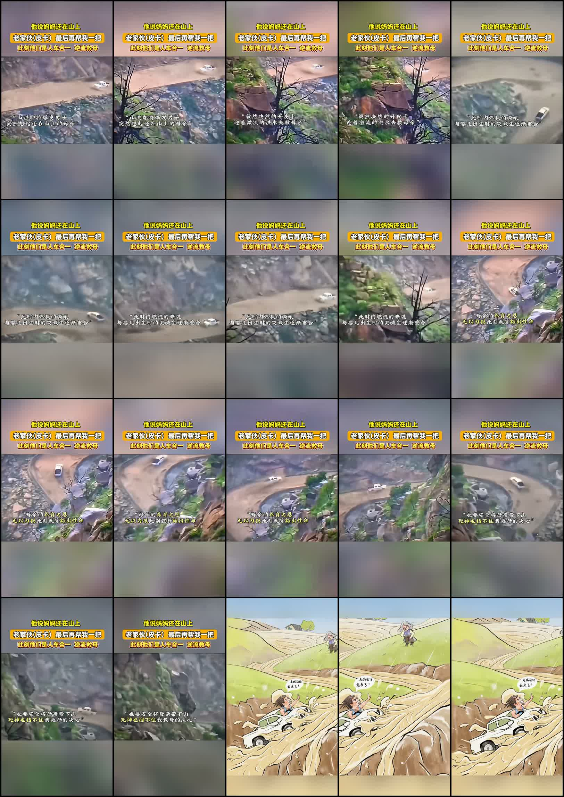
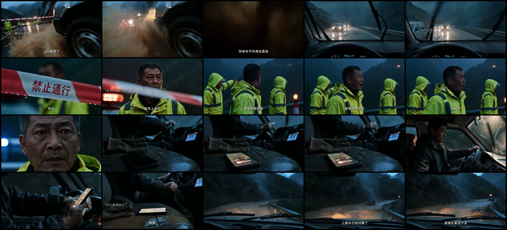
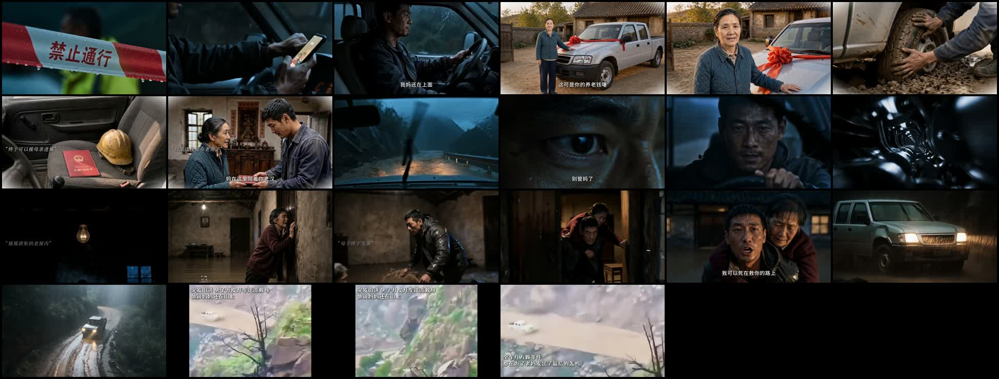
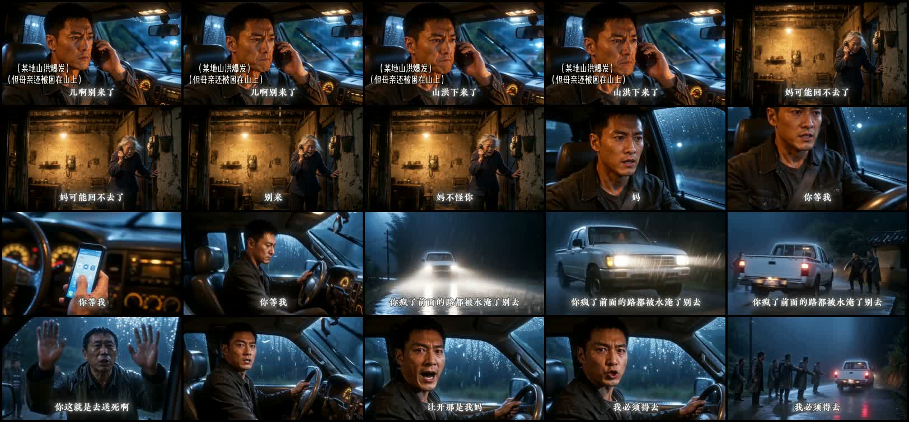
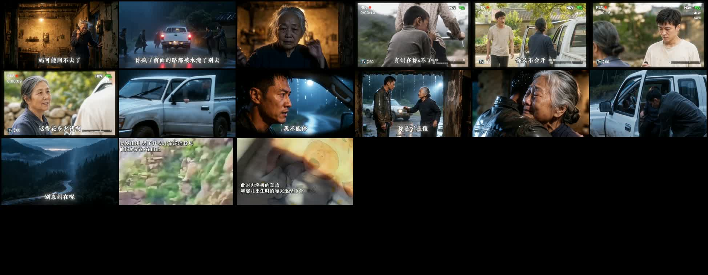

# 案例复盘：皮卡逆洪救母三种传播版本

采集与复盘日期：2026-08-27（Asia/Shanghai）

## 一、证据身份

本档对照同一“男子驾驶旧皮卡逆洪救母”叙事的三个公开传播版本。互动数据均为采集时页面展示值，会继续变化；它们只能证明作品获得过显著反馈，不能证明某一种开场写法单独造成传播。小画笔页面声明内容来源于 `@刺客`，画面包含现场影像与插画收尾；本档未独立核验原始事件、拍摄者和完整新闻事实，因此只把它记作“现场影像式短叙述”。

| 版本 | 作品 ID | 时长与规格 | 采集时页面快照 | 本地证据 |
|---|---|---|---|---|
| 小画笔《老家伙（皮卡）》 | `7463406173895527731` | 24.473 秒；1080×1920；30fps；HEVC＋AAC | 17.0 万赞、6231 评论、5764 收藏、4077 分享；作者当时 25.7 万粉丝；页面发布时间 2025-01-24 17:08 | `/Users/guodeqing/Documents/Codex/2026-08-22/rh/work/cases/pickup-rescue-mother/7463406173895527731.mp4`；SHA-256 `6c557d376c49a0c853e0622f5939a067b777483b3dfb02e8e972c488d6942b07` |
| 人间档案馆《他说妈妈还在山上》 | `7665714113179372835` | 215.435 秒；3838×2160；60fps；HEVC＋AAC | 28.6 万赞、1.2 万评论、2.2 万收藏、3.1 万分享；作者当时 4611 粉丝；页面发布时间 2026-07-23 21:25 | `/Users/guodeqing/Documents/Codex/2026-08-22/rh/work/cases/pickup-rescue-mother/7665714113179372835.mp4`；SHA-256 `d71d1672b088a3452473483ddea7f3403a851abf446f3c5f9084d5fe2f7674a4` |
| AI微光《内燃机最后的轰鸣，皮卡逆行救母》 | `7674534712224453810` | 153.366 秒；1254×720；30fps；H.264＋AAC | 16.4 万赞、1.4 万评论、1.6 万收藏、1.6 万分享；作者当时 3371 粉丝；页面发布时间 2026-08-16 15:54 | `/Users/guodeqing/Documents/Codex/2026-08-22/rh/work/cases/pickup-rescue-mother/7674534712224453810.mp4`；SHA-256 `6068c3cd30288901e61f5c32bdf8510ac962f0cb9a0850ecb984948396ba595e` |

按页面取整值近似计算：人间档案馆版评论/赞约 4.2%、收藏/赞约 7.7%、分享/赞约 10.8%；AI微光版约为 8.5%、9.8%、9.8%；小画笔版约为 3.7%、3.4%、2.4%。作者粉丝是传播后的采集值，不是发布前基线。

## 二、截图联系表

### 小画笔：约 24 秒整片，答案与名场面同时前置

### 人间档案馆：0—20 秒，先给异常逆行，再延迟答案

### AI微光：0—20 秒，先给被困与告别，再迅速让车辆行动

## 三、三种不同的开场发动机

### 1. 小画笔：完整答案＋现场奇观

约 24 秒的短版本从第一帧就叠加大字，直接告诉观众“妈妈还在山上”“老家伙最后再帮我一把”“人车合一逆流救母”。画面同时持续展示皮卡在现场洪水影像中前进，没有停下来补人物对话或背景。

它依赖的不是悬念，而是“难以相信会发生”的现场奇观与一句话英雄命题。完整答案已经公开，但视觉危险仍持续提供观看理由。该模式适合极短事件叙述，不应机械移植到需要关系铺垫的一分多钟剧情片；画面真实性仍需另行核验。

### 2. 人间档案馆：异常行动＋延迟答案

近似时间账本：

| 时间 | 可见或可听事实 | 追看职责 |
|---|---|---|
| 0—2 秒 | 皮卡已经冲过封锁带，车轮带水继续向前。 | 第一帧直接给违法常理的行动结果，不从停车、解释或人物介绍开始。 |
| 3—5 秒 | 驾驶员视角中，其他车辆迎面向外撤离。 | 建立方向异常：别人都在离开，只有它往危险内部走。 |
| 5—10 秒 | “禁止通行”封锁带和救援人员出现；有人认出这辆车。 | 把抽象危险变成公共阻力，同时增加“这是谁、为什么不停”的人物问题。 |
| 11—16 秒 | 驾驶室内电话响起，司机接听，前方积水继续运动。 | 新信息到达，但车辆没有停止；叙事仍在行动中推进。 |
| 约 17—20 秒 | 电话与字幕进一步说明山上水情，随后才明确母亲仍在山上。 | 延迟交出第一层答案，把追问从“为什么逆行”改成“他能不能赶到”。 |

该版本不是答案前置。它把“只有一辆车逆着撤离方向冲入封锁”当作谜面，约 20 秒后才用母亲被困作答。长时长允许它让异常行动独立支撑较长追问。

### 3. AI微光：危险答案＋告别升级

近似时间账本：

| 时间 | 可见或可听事实 | 追看职责 |
|---|---|---|
| 0—3 秒 | 儿子在暴雨驾驶室接电话；文字直接说明山洪暴发、母亲被困；母亲说山洪已经下来。 | 同时交代关系、地点和即时危险，不要求观众猜人物身份。 |
| 4—7 秒 | 母亲表示自己可能回不去，让儿子别来，并说不怪他。 | 不是重复“被困”，而是把危险升级成母亲主动告别。 |
| 8—10 秒 | 儿子回答“你等我”。 | 给出反向承诺，把追看问题改成他是否真的会行动。 |
| 11—14 秒 | 皮卡已在暴雨中前进。 | 对承诺立即给出动作回报。 |
| 15—19 秒 | 人群阻拦并说这是送死；儿子强调母亲在那里、自己必须去，车辆继续驶离。 | 安全选项与真实阻力同时出现，人物当场放弃退路。 |

该版本确实前置答案，但真正有效的信息不是“母亲被困”本身，而是前七秒迅速升级到母亲可能死亡和主动告别；随后承诺立即转化为车辆行动。

## 四、不能再混淆的共同规律

三条作品并不共享“答案必须放第一秒”这一固定格式：

- 小画笔版直接交出完整答案，依靠真实奇观继续留人；
- 人间档案馆版先给逆行异常，约 20 秒后才交出母亲被困；
- AI微光版第一秒交代被困，但立即升级到告别与送死选择。

它们真正共享的是：

1. **第一帧已经处在高代价事件里。** 车在洪水中、车已越过封锁，或母亲已经开始告别；没有先拍环境、停车和人物准备。
2. **画面与信息持续改变状态。** 突破、逆向车流、电话到达、死亡告别、承诺、阻拦和继续前进依次发生；不会连续数秒只换台词而不改变行动关系。
3. **开场只选择一种驱动。** 要么让观众追问“为什么只有他逆行”，要么直接告诉“母亲要死了”并追问“他敢不敢去”；不要同时提前解释答案、让车辆保持静止，再重复同一危险。
4. **前置的是危险与选择，不必前置最终高潮。** 两条长AI版本都没有把“老伙计／内燃机重启”的最终回报剪到第一秒。高潮仍需由车辆关系与代价铺垫后爆发。

## 五、75—95 秒原创的迁移方案

默认优先采用“短混合结构”，而不是复制任何一条原片：

| 时间 | 最低信息与动作要求 |
|---|---|
| 0—0.8 秒 | 车辆已经突破或正在挤过阻拦；阻止声通过声音先到。 |
| 0.8—1.8 秒 | 主角朝阻拦者喊出最短关系答案，例如“我妈还在上面”。 |
| 1.8—3.2 秒 | 换挡、抬转、追车或车轮越线，明确表现选择已付诸行动。 |
| 3.2—5.2 秒 | 被困者的空间危险升级，不再重复“被困”，而是出现进水、结构受损或告别。 |
| 5.2—9 秒 | 主角给出行动承诺并继续前进，九秒内进入下一重真实阻力。 |

对白身份建议区分：主角对外解释时说“我妈”，先保证首遍理解；只有当旧车已被建立为家庭成员，主角单独对车说话时才使用“咱妈”，让车辆人格化成为中段回报。

### 禁用的弱混合

以下组合在冷启动中风险很高：

`第一秒文字说完母亲被困 → 车辆仍停在原地 → 数秒后才喊关系答案 → 转入长电话重复别回来 → 真正逆行延迟出现`

这既消耗了谜面，也延迟了动作回报。修法不是机械把一句台词提前，而是让阻力、关系答案和有价选择在前三秒形成一个完整小闭环。

## 六、评论共鸣补充

AI微光版采集时可见首屏评论中明确出现：

- 私人经历：有人讲述自己曾驾驶家中车辆把洪灾中的爷爷奶奶接回；
- 价值表态：有人表示面对母亲会毫不犹豫；
- 有价选择认领：有人表示即使救不到、倒在半路也愿意承担；
- 集体身份提问：高赞评论用“这个男人是什么”邀请观众共同命名人物行为，并形成大量回复。

这是非随机首屏样本，个人经历未经核验。它支持把本题材的互动中心优先检查为“亲人不是可计算选项＋普通人在灾难中认领责任＋车辆兄弟感”，不能证明喊口号本身导致传播。

## 七、事实、推断与决定

- **事实**：三条同题材作品存在三种不同开场；人间档案馆版先展示突破封锁和逆向车流，较晚交出母亲信息；AI微光版第一秒交代被困，七秒内升级为母亲告别，随后立刻行动；小画笔短版从第一帧同时给完整文字答案和现场洪水影像。
- **推断**：第一帧进入高代价事件、后续状态持续升级，较可能比“先解释清楚再行动”更适合冷启动；公开互动不能证明其中任一手法是单一原因。
- **决定**：以后分析“皮卡救母／逆洪救母”或相邻灾难亲情题材时，必须先选择“异常谜面”或“危险答案”中的一个作为开场发动机；不得再笼统概括为“爆款就是答案前置”。对一分多钟原创，优先在前三秒完成阻力、关系答案与行动选择，把“咱妈”和引擎爆发保留为中段人格化回报。
