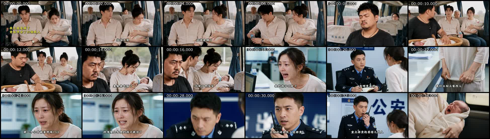
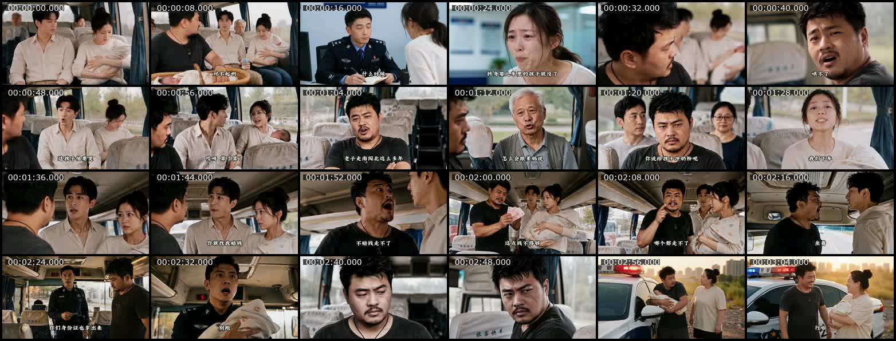
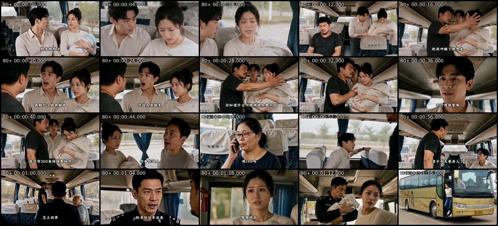
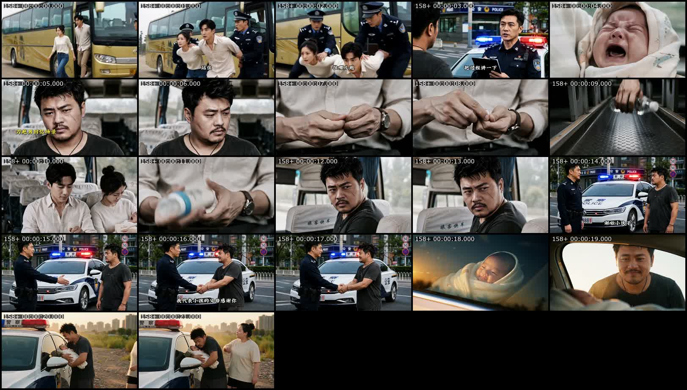

# 案例复盘：烟火漫镜《谋士以身入局》（天下无拐）

采集与复盘日期：2026-08-22（Asia/Shanghai）

## 一、证据身份

- 抖音作品 ID：`7673388371231084530`；页面标题为“谋士以身入局，举棋胜天半子”，带有“天下无拐”“宝贝回家”“打拐”等标签；下载元数据的 `artist` 字段为“烟火漫镜”。
- 页面地址：`https://www.douyin.com/video/7673388371231084530`。
- 下载元数据记录发布日期为 2026-08-13；采集快照为 106,460 赞、794 评论、4,659 分享。评论/赞约 0.75%，分享/赞约 4.38%；未取得收藏数，不能补估。
- 本地源片：189.753 秒，1280×720，30fps，HEVC＋AAC；SHA-256：`ad3b4d7413b6869f3017d7b21fd01fdfbe9a7b630d3135d6981a3b9c6367c03c`。
- 自动切点阈值 `scene > 0.22` 检测 123 个切点、约 124 个镜头；平均约 1.53 秒，中位约 1.18 秒；75 镜不超过 1.5 秒，101 镜不超过 3 秒，仅 3 镜超过 6 秒。
- 响度测得约 -8.1 LUFS，LRA 约 3.0 LU，True Peak 约 +1.2 dBFS。它整体偏响且动态范围较窄，不能把这一混音状态当作传播原因。
- 公开源片没有独立字幕轨。剧情核对依据烧录字幕、逐秒关键帧和动作连续性；下文不把自动 OCR 错字当作台词事实。

## 二、截图联系表

### 0–36 秒：假父母、刀疤男与真实报案

### 全片：每八秒一帧

### 80–160 秒：拦车、索赔、威胁与身份检查

图中时间标签为 `80 秒＋片段内时间`。

### 158–180 秒：逃跑、药片证据与人物改义

图中时间标签为 `158 秒＋片段内时间`。

## 三、一句话故事

一名带自己孩子坐客车的刀疤男发现邻座男女疑似给陌生婴儿下药；在没有身份和执法权的情况下，他故意把自己演成敲诈、拦人甚至要动手的恶人，用自己的名誉与风险把冲突升级到警方查验身份，最终迫使抱婴男女露出逃跑反应。

## 四、详细剧情账本

时间段为依据源片、关键帧和切点整理的近似值。

| 时间 | 片中可见或可听事实 | 观众位置与叙事职责 |
|---|---|---|
| 0–17 秒 | 客车内，一对外表体面的年轻男女抱着哭闹婴儿，拿奶瓶喂孩子；一个外貌凶悍的刀疤男坐在邻座观察，身边也带着自己的婴儿。开场文字提到“以貌取人”。 | 首次观看时，年轻男女像正常父母，刀疤男更像潜在危险者。画面先利用外貌和照料姿态分配错误信任，但前三秒主要依赖抽象文字和婴儿哭声，严格说还不是强烈的可见冲突。 |
| 18–33 秒 | 镜头切到公安场所，另一名母亲哭诉孩子刚在市场门口失踪；警察询问时间地点并立即组织排查。 | 观众提前确认“有婴儿刚被拐”，并开始怀疑客车上的年轻男女。此处回答犯罪事实，却没有回答刀疤男究竟知道多少、准备做什么。 |
| 34–65 秒 | 回到客车，婴儿继续哭。普通乘客催“父母”哄孩子；刀疤男以哭声惊扰自己孩子为由粗暴指责。年轻男女和旁人反驳，认为他在欺负带孩子的父母。 | 刀疤男主动把自己推向全车人的对立面。观众已知道车上可能有拐卖，却仍容易把他的粗暴理解成无关的恶行。 |
| 66–84 秒 | 刀疤男不断追问两人是否知道孩子为何哭；老人判断孩子饿了，众人劝他们冲奶粉。刀疤男盯着奶瓶与两人的反应。 | 表层仍是育儿争吵；暗层是在测试两人是否具备真实父母的照料知识，并持续盯住此前可疑的奶瓶。 |
| 85–94 秒 | 抱婴女人提出提前下车，并让司机靠边。 | 当下困境被具体化：车门一开，嫌疑人与婴儿就可能离开公共视线。 |
| 94–128 秒 | 刀疤男突然起身拦住他们，以孩子哭闹影响自己为由索要赔偿；年轻男人愿意拿钱息事，他仍嫌钱不够并拒绝放人。其他乘客纷纷认定他无理取闹。 | “伪恶”不是等待误会，它实际执行两个功能：拖住准备下车的人，并让冲突持续留在全车见证之下。代价是他主动承受恶名、冲突升级和被警方处理的风险。 |
| 129–141 秒 | 刀疤男继续升级威胁，宣称今天可能动手；警车靠近，警察登上客车。 | 他把普通纠纷推到必须由公共权力介入的级别。高潮不是他口头揭穿，而是强制程序终于到场。 |
| 142–158 秒 | 乘客向警察指认刀疤男索钱、威胁。警察要求他出示身份证，并要求年轻男女也出示身份证。抱婴女人把孩子交给警察，假装寻找证件；两人突然冲下车逃跑，随即被警察追赶控制。 | 身份检查成为陷阱的视觉回报。孩子的空间归属先从嫌疑人怀中转到警察怀中，再以嫌疑人逃跑完成当场自证；观众第一次看就能理解谁真正危险。 |
| 159–175 秒 | 警方询问经过。短回看补出：年轻男女曾把药片碾碎放进奶瓶，奶瓶滚落时被刀疤男注意到。警察向他致谢，并代孩子父母感谢他的帮助。 | 后置证据重新解释他的观察、盘问、拦路和索赔。它不是突然赋予英雄身份，而是为已经产生实际结果的一连串旧动作补足动机。 |
| 176–190 秒 | 刀疤男抱回自己的孩子，与来接他的妻子会合。妻子埋怨本来只是让他带孩子进城打疫苗，怎么折腾到这里；他笑称自己又救了一个家庭，让妻子回去犒劳自己。 | 结尾用夫妻生活笑点给高压情节卸力，把“英雄”重新放回普通父亲身份；温暖来自他也在照料自己的孩子，而不是再追加一轮哭诉。 |

## 五、这部片真正有效的结构

### 1. 不是“坏人后来洗白”，而是“伪恶本身在执行救人方案”

刀疤男的粗暴行为同时完成：

`阻止下车 → 聚集见证 → 触发报警或警方介入 → 迫使所有人查身份证 → 让真正嫌疑人失控逃跑`

因此后段改义的是同一串动作，而不是补一句“其实他是好人”。可迁移的核心检查是：删掉误会包装后，这个坏动作是否仍然产生不可替代的现实效果。

### 2. 观众知情分三层推进

1. **0–17 秒**：观众按外貌分配信任；
2. **18–33 秒**：观众比乘客先知道有孩子失踪，却不知道刀疤男掌握了什么；
3. **159 秒后**：观众才看到药片与奶瓶，理解他为何选择设局。

它不是把所有真相压到结尾，而是先交出犯罪事实，再延迟人物动机。这样中段追看的问题不是单纯“孩子是否被拐”，而是“这个看起来更坏的人到底在做什么”。

### 3. 高潮是一道公共程序，不是一句英雄台词

最清楚的回报动作是：警察要求所有人出示身份证；女人先把婴儿交到警察手里，再与同伴逃跑。这个动作同时完成孩子脱险、嫌疑人自曝和刀疤男改义，信息密度很高。

### 4. 奶瓶先是日常用品，后变成犯罪证据

奶瓶经历“喂孩子的普通物件→滚落引起观察→回看中显出药片→解释刀疤男行动”的改义。它比事后拿出一张陌生证明更好，因为物件从开场就在场，并实际触发了选择。

### 5. 笑点承担人物落地和情绪泄压

最后妻子关于打疫苗的责问和丈夫讨犒劳的玩笑，不负责再解释打拐主题，而是告诉观众：这个敢冒险的人也是一个会怕妻子、会邀功、要带孩子打针的普通父亲。笑点出现在主要回报之后，没有抢走抓捕结果。

## 六、生产闸门复盘

按源片自身约 190 秒规格，它的设局、选择和回报成立；按本技能 75–95 秒、单主场景硬门，它只能作为机制参考，不能直接进入生产。

| 检查 | 事实判断 | 结果 |
|---|---|---|
| 一个核心关系 | 主轴是陌生父亲保护被拐婴儿，但假父母、亲生母亲、警方、乘客和刀疤男家庭都占据理解位置 | 三分钟规格可接受；一分半需合并人物 |
| 一个时间窗口、一个主场景 | 主要发生在一次客车行程，但插入公安报案和车外抓捕、家庭收尾 | 三分钟通过；一分半不直接通过 |
| 一个当下困境 | 嫌疑男女即将带婴儿提前下车 | 通过 |
| 真实阻力 | 刀疤男没有执法身份，证据不足，嫌疑人可随时下车并销毁证据 | 基本通过，但部分需要观众补推 |
| 当场有价选择 | 他主动把自己演成敲诈和威胁者，承担恶名、冲突和可能被警方处理的风险 | 通过 |
| 猛烈视觉回报 | 查身份证时孩子先被交到警察怀里，嫌疑男女逃跑并被控制 | 通过 |
| 前 3–5 秒视觉钩子 | 婴儿哭、假父母喂奶、刀疤男观察；主要追问仍由抽象开场字和约 8 秒后的刀疤男建立 | 按严格预设偏弱 |
| 解释消失测试 | 最早可直说：“我看见他们往奶瓶里放药，别让他们下车，报警。”抓捕和身份核验仍需发生，但原片没有充分展示直接报警为何不可行 | 条件通过；改编必须补真实限制 |

### 最重要的逻辑风险

原片没有明确交代：刀疤男为什么不能立即把药片事实告诉司机、乘客或警方，也没有明确展示警方如何被叫来。观众可以用“怕打草惊蛇、证据会被毁、需要拖到警方到场”补全，但在本技能的生产闸门里，不能要求观众替作者补关键必要性。

改编时至少补一个可见约束，例如：

- 前方就是检查点，嫌疑人要求提前下车，英雄必须把他们拖到检查点；
- 车内无信号，司机已经开始开门，公开指认会让嫌疑人立刻弃婴逃跑；
- 药片已经溶解、奶瓶即将被丢弃，单凭口头指控不足以完成身份控制。

只选其中一个，不要叠加解释。

## 七、对 75–95 秒创作的迁移决定

建议只迁移这条行动链：

`看见可疑物件 → 嫌疑人即将离开 → 主角主动扮坏并付出名誉 → 强制程序到场 → 真嫌疑人因程序露馅 → 旧物件补足动机`

压缩时：

- 全部留在客车及车门相邻空间；
- 删除公安报案室和回家后的第二现场；
- 合并乘客，只保留一名见证者或司机；
- 奶瓶作为唯一核心物件，按“普通奶瓶→可疑滚落→警方证物”改变状态；
- 药物只表现为不明药片或粉末，不出现名称、剂量和可复制操作；
- 开场三秒直接给出可见冲突或危险，不依赖“以貌取人”抽象文字；
- 必须补出“为什么不能直接说明”的单一真实限制。

## 八、事实、推断与决定

- **事实**：源片以客车为主场景；亲生母亲报案在前段出现；刀疤男阻止抱婴男女下车并索赔、威胁；警方查身份证时二人把孩子交给警察后逃跑；后段回看显示他们把药片放进奶瓶，刀疤男曾注意到；结尾显示刀疤男自己也是带孩子进城打疫苗的父亲。
- **推断**：把英雄行为写成会触发公共程序的“伪恶行动”，较可能比单纯隐藏善意更有行动力度；高互动与该机制之间没有可证明的单因果关系。
- **决定**：将本案例归入“策略性伪恶＋公共程序回报”；未来借鉴时强制检查伪恶动作的必要功能和直接解释为何无效，不复制其具体打拐情节、台词或人物外貌。

## 九、热门评论复盘

### 采样事实

- 采集时间：2026-08-22 22:36–22:42（Asia/Shanghai）。
- 抖音公开旧版评论接口每次返回 10 条顶层推荐评论，游标没有形成稳定翻页。
- 共记录 30 次响应、300 条返回记录；按评论 ID 去重后得到 18 条可读顶层评论。
- 这是推荐/热评去重样本，不是随机样本、完整评论区或真实人口比例；评论点赞会变化，嵌套回复正文没有成功取得。

### 去重样本的主标签

| 主标签 | 条数 | 主要内容 |
|---|---:|---|
| 剧情理解 | 6 | 回看刀疤男早期问话、注意结尾救人台词、复述真假人贩子、解释伪恶策略 |
| 价值表态 | 6 | 承认以貌取人、为误判羞愧、重新命名刀疤男的强者形象 |
| 私人经历 | 1 | 用真实带娃所需用品判断片中照料细节是否可信 |
| 关系行动 | 0 | 未见明确转发、联系或现实补偿行动 |
| 制作讨论 | 3 | 询问影视来源、公益广告或系列归属 |
| 困惑争议 | 2 | 不理解刀疤男为何抢人；质疑奶瓶与药物细节 |

### 热评对剧情分析的验证

1. **最高赞评论在回看伏笔。** 采集时约 7,419 赞的评论注意到刀疤男早先已经追问孩子身份，说明结尾改义后，观众会回头重新理解前段问话。
2. **人物余韵被接住。** 约 5,122 赞的评论注意到他最后说自己“又拯救了一个家庭”，将其理解成稳定的人物性格或系列身份。
3. **主要情绪是自我改判。** 约 4,722 赞的评论和多条同类评论承认自己也因外貌误判；这更接近认知爽感、羞愧与敬意的释放，不等于深层泪点。
4. **母职判断形成高争议议题。** 约 3,735 赞、100 条回复的评论认为真正母亲能哄好孩子。该说法在现实中并不可靠，不能把母亲哄不好孩子写成犯罪铁证；更稳妥的是可见的照料物品、流程错误与身份核验共同成立。
5. **逻辑缺口被真实评论击中。** 一条约 107 赞、8 条回复的评论明确不理解刀疤男为什么要抢人。这与生产评审中的“为什么不能直接说明或报警”风险一致，说明改编时必须把伪恶策略的必要性拍出来。

### 评论带来的最终决定

- 保留：早期身份追问、结尾重新理解旧问话、普通父亲式笑点。
- 加强：直接说明无效的真实限制，以及伪恶动作如何一步步触发身份检查。
- 替换：不要用“亲生母亲一定能哄好孩子”作为决定性线索；改用多项生活细节加公共核验。
- 情绪定位：优先归入“正义释放＋认知反转＋普通人勇气”，不把它作为强泪点案例的唯一依据。

更完整的采样口径与跨案例说明见 `../audience-resonance-evidence.md`。
