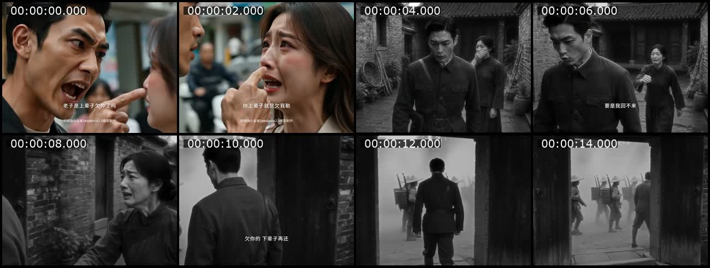
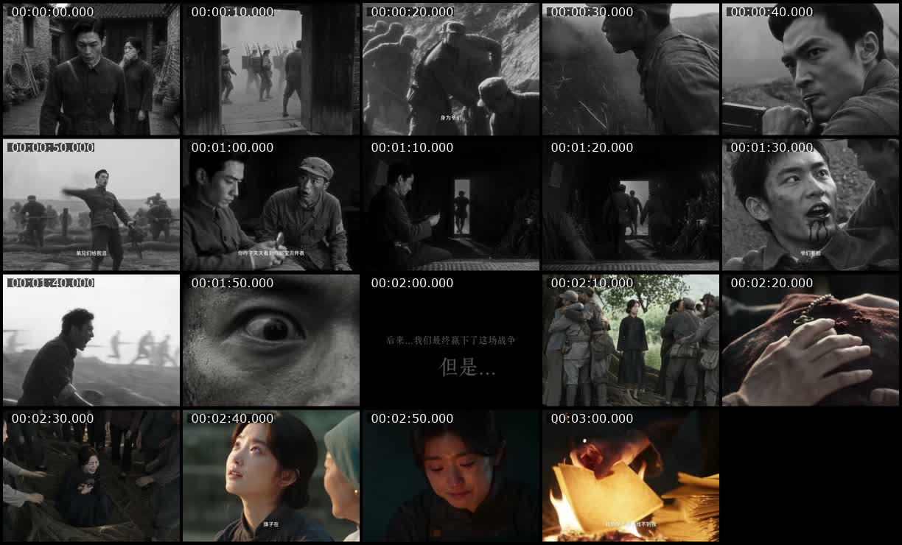
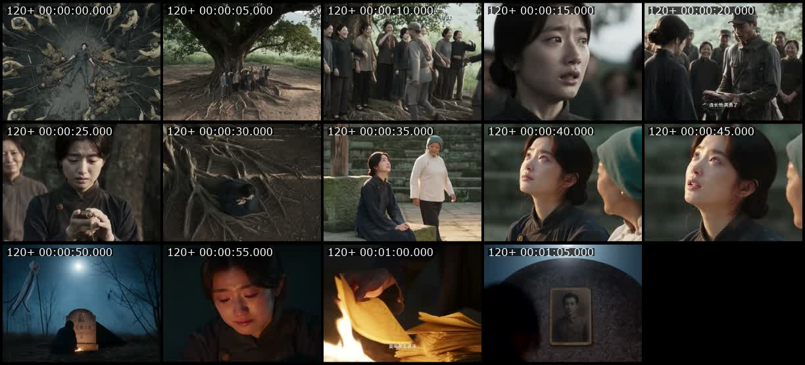

# 案例复盘：《爷们》

采集与复盘日期：2026-08-22（Asia/Shanghai）

## 一、证据身份

- 抖音作品 ID：`7676597230404488486`；作品标题：《爷们》。下载元数据的 `artist` 字段为 `$ERFER`，`uploader` 字段为 `X6303545`，保留字段差异，不进一步推定真实作者身份。
- 页面地址：`https://www.douyin.com/video/7676597230404488486`。
- 本地源片：190.079 秒，960×720，30fps，HEVC＋AAC；SHA-256：`6a30fc558b4b3c200f10d17af339336257a0498ca7f3fb721b9372479208c77e`。
- 下载元数据快照：377,532 赞、38,596 评论、44,054 分享；收藏快照见项目采集记录。互动会变化，且不能证明下述结构造成了互动。
- 自动切点阈值 `scene > 0.22` 检测约 44 个镜头，平均约 4.32 秒，中位约 3.40 秒；响度测得约 -11.9 LUFS，LRA 约 10.0 LU，True Peak 约 +1.0 dBFS。

## 二、截图联系表

### 开场 0–16 秒：冲突成为谜面，前世开始作答

### 全片：每十秒一帧

### 结尾 120–190 秒：牺牲、遗物和来世回收

图中时间标签为 `120 秒＋片段内时间`。

## 三、详细剧情账本

以下时间为依据源片、联系表和自动切点整理的近似段落，不把对白自动转写错字当作事实。

| 时间 | 片中可见或可听事实 | 叙事职责 |
|---|---|---|
| 0–3 秒 | 彩色当代街头，一对男女激烈争执。男人用“上辈子欠你”表达愤怒，女人正面回应。 | 先建立真实的当下冲突。对首次观看者，这句话仍是常见气话；它提出“他是否真的欠过她”的追看问题，并没有先交出完整答案。 |
| 3–13 秒 | 画面突然转为黑白旧时空。男人穿军装离家，嘱咐妻子若自己回不来便不要等，并把未偿之欠推到下一世。 | 前三秒的比喻性气话被改写为字面承诺。第一层问题迅速获得答案：两人确有一段“上辈子”的未竟关系；新的问题变成他为何回不来、欠下什么、能否偿还。 |
| 13–58 秒 | 战士进入战场；连长动员部队抵抗侵略。敌军退却后，他仍带队继续追击，把战友伤亡转化为必须付诸行动的战场责任。 | 建立无法靠夫妻解释消除的阻力：战争、军令、伤亡和公共使命。私人承诺被更大的现实责任压住。 |
| 58–75 秒 | 夜间短暂安静，连长打开怀表，看见表盖内妻子的照片，并用表的走动计算离家时间。 | 用一个可携带的小物件把宏大战争重新拉回夫妻关系；怀表同时承担思念、时间和“回家”的替代动作。 |
| 75–100 秒 | 新作战命令到来，部队休整和弹药条件不足。战斗中连长受伤；战友试图带他撤离，他拒绝生路，选择留下继续作战。 | 形成不可兼得的当场选择：活着回去与履行军人责任不能同时保住；选择的生命代价立即生效。 |
| 100–128 秒 | 连长继续近身战斗，被敌军围住并最终倒下；俯拍把他与周围战场后果同时纳入画面。 | 第一次观看即可理解的猛烈行动回报，兑现“以命相赴”，而不是靠说明文字宣布勇敢。 |
| 129–157 秒 | 战争结束后的村庄恢复彩色。幸存战友回村，只带回血衣和怀表；妻子打开怀表，看见自己的照片，确认丈夫没有归来。 | 怀表改变归属，从丈夫手中的思念物变成妻子手中的死亡确认；前段已建立的物件承担结果，不是结尾临时补证。 |
| 157–190 秒 | 妻子在旗杆、墓前和夜色中继续守候；焚烧纸钱时担心丈夫转世后找不到自己，最后落在旧照片上。 | “下辈子”第二次出现，回收离家承诺，也反向确认开场当代两人的相遇可以被理解为上一世关系的延续。 |

## 四、对前三秒的正确判断

### 不是“先给答案”

前三秒首先是一个可以独立成立的关系冲突。即使删掉后面的前世段落，观众仍会把它理解为情侣争吵中的反问和顶嘴。此时观众得到的是谜面：他们为什么吵、男人是否真的欠她、这句话会造成什么后果。

### 切入前世后，钩子才变成第一层答案

3 秒后的黑白旧时空重复“欠”和“下辈子”的语义，使观众意识到开场并非单纯修辞。它完成的是一次语义改判：

`普通气话 → 关系谜面 → 前世事实 → 未偿承诺`

巧妙之处不只是前世反转，而是同一句日常语言在两个时间层拥有两种都成立的含义。第一层答案很早出现，却没有耗尽悬念，因为观众还要追问：他究竟为什么没回来、付出了什么、今生相遇是否完成偿还。

### 结尾完成第二次回收

结尾再以妻子对来世重逢的担忧回收“下辈子”。于是开场不只是一个巧合式反转，而成为上一世承诺在今生的结果。影片没有回到当代再解释，观众已经能自行完成闭环。

## 五、可迁移机制

### 1. 冲突谜面→字面兑现

先让一句熟悉的气话、指责或反问制造真实冲突；后段通过时间、身份或物件，把其中一个关键词变成字面事实。必须满足：

1. 开场本身有冲突，不依赖后文才能成立；
2. 后段回收同一个词、动作或物件，不是突然换一套故事；
3. 第一层答案出现后，仍有更深的代价问题继续驱动观看；
4. 结尾用行动或结果完成第二次回收，不再长篇解释主题。

### 2. 私人物件穿过公共困境

怀表不是装饰。它先由丈夫打开以替代回家，后由战友交还，再由妻子打开确认死亡。可迁移的是“同一物件改变状态与归属”，不是复制怀表或遗物。

### 3. 人物在撤退机会出现时作选择

有价选择之所以清楚，是因为安全选项已经摆到眼前：战友要带他走。他主动放弃生路，代价随即发生。若没有可见的替代选项，人物的牺牲容易被看成被动受难。

### 4. 高潮之后减速

战斗承担速度和危险，遗物交还、妻子确认和余生守候承担反应与余波。结尾没有再增加一个新反转，而是让已经发生的选择落在人身上。

## 六、对 75–95 秒故事的迁移边界

《爷们》本身是约三分钟、多时间层、多场景、战争群像作品，不是单主场景一分半的直接生产模板。

一分半默认只借其中一个机制，优先级如下：

1. 借“冲突谜面→字面兑现”的开场和回收；
2. 或借一个物件三次改变状态；
3. 或借“安全选项出现→角色主动放弃”的有价选择。

不要同时照搬前世长段落、战争动员、战斗高潮、遗物归还和余生守候。若使用前世今生，只允许短回忆补一个事实，核心困境、选择和猛烈回报仍应发生在唯一主场景。

## 七、创作与评审提问

- 前三秒删去后文还能否独立构成冲突？如果不能，它只是预告，不是冲突钩子。
- 后段是否把开场的同一个词或动作变成字面事实？如果只是补身份介绍，不算语义兑现。
- 第一层答案出现后，观众是否立刻获得一个更深、更具体的问题？如果没有，早揭晓会泄掉追看动力。
- 人物是否面对无法靠解释消除的阻力，并在镜头中放弃一个真实选项？
- 结尾是否用结果回收开场，而不是重复金句解释一次？

## 八、事实、推断与决定

- **事实**：片中先出现当代争执，约 3 秒切入黑白旧时空；“欠”和“下辈子”在开场、离家承诺与结尾守候中重复；怀表从丈夫转到妻子；人物面对撤离机会时选择留下。
- **推断**：这种“熟悉气话被后文证明为字面事实”的语义改判，较可能同时降低开场理解成本并增加重看快感；单案例不能证明它导致高互动。
- **决定**：今后使用本案例时，将其归类为“冲突谜面→字面兑现”，不归类为普通答案前置；在一分半项目中迁移机制，不迁移三分钟事件规模。
